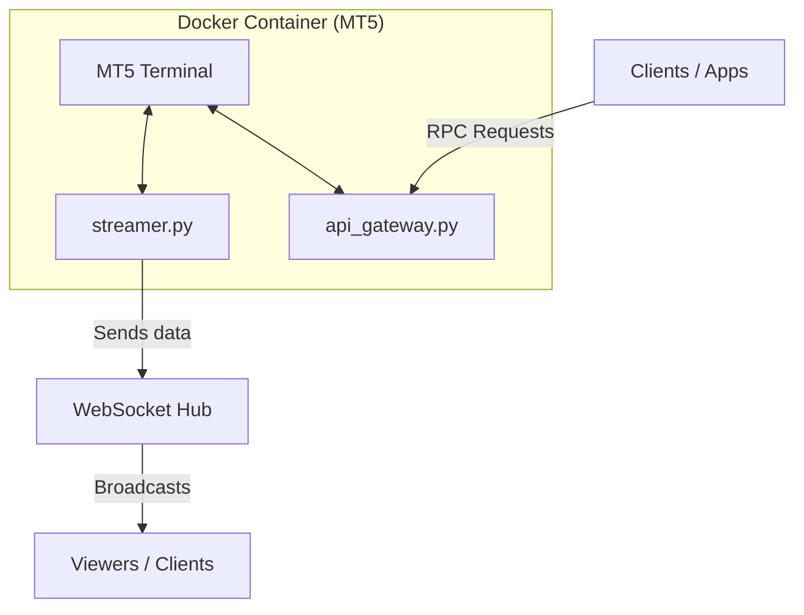

# Dockerized MetaTrader 5 with Python Data Bridge


**This repository provides everything needed to run a portable MetaTrader 5 (MT5) inside a Docker container and expose its full functionality to your apps via a WebSocket stream and a secure, general-purpose RPC API Gateway.**

---

## What this repo does

* Runs a **portable MT5 terminal** inside a Windows container.
* Streams live account information (balance, equity, open trades, etc.) from the MT5 instance using `streamer.py` to a central **WebSocket Hub**.
* Exposes a **secure RPC (Remote Procedure Call) API Gateway** (`api_gateway.py`) that allows you to execute almost any function from the Python `MetaTrader5` library remotely, protected by an API key.
* Intended audience: Developers and algorithmic traders who want full, programmatic access to MT5 data and trading functions without running the terminal on their local machine.

### Architecture Overview



---

## Quick overview (short)

* Build the image locally: `docker build -t immahdi/mt5-python:latest .`
* Or pull a prebuilt image from Docker Hub: `docker pull immahdi/mt5-python:latest`
* Run a central WebSocket Hub on a server (see `websocket_hub.py`).
* Run one or more MT5 containers that connect to the Hub and the API Gateway.
* Use a client to connect to the WebSocket Hub for live data, and send authenticated requests to the `/rpc` endpoint on the MT5 container to execute any command.

Docker Hub: [DockerHub/mt5-python](https://hub.docker.com/r/immahdi/mt5-python)

---

## Files in repository (root) — what each file is for

* **Dockerfile** — builds the Windows container image with portable MT5 and the Python services.
* **docker-compose.yml** — Simplifies running the container with predefined configurations and environment variables.
* **.env.example** — Example environment file containing required configuration values.
* **requirements.txt** — Python dependencies required for the services.
* **.dockerignore** — Specifies files and directories to ignore when building the Docker image.
* **src/streamer.py** — The inside-container service that reads MT5 account state and open trades and forwards JSON messages to the WebSocket Hub.
* **src/api_gateway.py** — Exposes a secure, general-purpose RPC API on port `8080`. It listens for requests at the `/rpc` endpoint and executes `MetaTrader5` functions dynamically.
* **src/start.ps1** — The PowerShell startup script used inside the container to launch both the `streamer` and `api_gateway` services.
* **websocket_hub/websocket_hub.py** — The central WebSocket Hub/Router. It accepts connections from multiple streamers and viewers and broadcasts data. **Run this on the machine you want to host the hub.**
* **tests/test_api_connection.py** — An integration test script to verify that the API Gateway is running correctly and responding to requests.
* **meta.zip** — (large) The portable MetaTrader 5 files. *Not checked in by default.* You must download this file and place it in the repo root before building the image locally.

> **Note:** You must download `meta.zip` and the Python 3.11 installer (e.g., `python-3.11.4-amd64.exe`) and place them at the project root before building locally.

Download `meta.zip` (place in repo root):
* [meta.zip](https://drive.google.com/uc?export=download&id=1Uiwa4GjQMksct8ZGqIvhg_WdIGuvaiJu)

---

## How to run (recommended workflow)

### 1) Run the WebSocket Hub (on a server or a user machine)

```bash
git clone https://github.com/im-mahdi-74/Dockerized-MetaTrader5-with-Python-DataBridge.git
cd Dockerized-MetaTrader5-with-Python-DataBridge
python -m pip install --user websockets
python websocket_hub/websocket_hub.py
```

The Hub listens on `ws://0.0.0.0:8765` by default.

### 2) Run the MT5 container with Docker Compose (Easiest Method)

The easiest way to run the container is using Docker Compose. Make sure you have copied `.env.example` to `.env` and filled in your details:

```bash
docker compose up -d
```

### 3) Build the Docker image locally (optional)

If you prefer to build the image yourself (you must have `meta.zip` and the Python installer at the repository root):

```bash
# from repository root where Dockerfile is located
docker build -t immahdi/mt5-python:latest .
```

**Or** pull the prebuilt image from Docker Hub:

```bash
docker pull immahdi/mt5-python:latest
```

### 4) Run the MT5 container using Docker Run

```bash
docker run -d --name my-mt5-bot \
  -p 8080:8080 \
  -e MT5_ACCOUNT="YOUR_ACCOUNT_NUMBER" \
  -e MT5_PASSWORD="YOUR_ACCOUNT_PASSWORD" \
  -e MT5_SERVER="YOUR_MT5_SERVER_NAME" \
  -e WEBSOCKET_URI="ws://<hub-server-ip>:8765" \
  -e API_KEY="YOUR_SUPER_SECRET_KEY" \
  immahdi/mt5-python:latest
```

* Set `WEBSOCKET_URI` to the Hub address.
* Set a unique and secret `API_KEY` which will be used to authenticate your RPC requests.

### 5) View live data (viewer client)

You can run this Python snippet to connect to the WebSocket Hub and see the live data stream:

```python
import asyncio
import json
import websockets

async def view_stream():
    uri = "ws://your-hub-server:8765"
    async with websockets.connect(uri) as ws:
        await ws.send(json.dumps({"type": "viewer_hello"}))
        print("Connected as viewer. Waiting for data...")
        async for message in ws:
            data = json.loads(message)
            print(json.dumps(data, indent=2))

if __name__ == "__main__":
    asyncio.run(view_stream())
```

### 6) Execute MT5 Functions via RPC API

You can execute almost any MT5 function by sending a `POST` request to the `/rpc` endpoint.

---

### 🔹 Example 1: Get Account Info

```bash
curl -X POST http://<docker-host-ip>:8080/rpc \
-H "Content-Type: application/json" \
-H "X-API-KEY: YOUR_SUPER_SECRET_KEY" \
-d '{
    "function_name": "account_info"
}'
```

---

### 🔹 Example 2: Place a Trade (Order Send)

```bash
curl -X POST http://<docker-host-ip>:8080/rpc \
-H "Content-Type: application/json" \
-H "X-API-KEY: YOUR_SUPER_SECRET_KEY" \
-d '{
    "function_name": "order_send",
    "kwargs": {
        "request": {
            "action": 1,
            "symbol": "EURUSD",
            "volume": 0.01,
            "type": 0,
            "price": 0,
            "magic": 123456,
            "comment": "Sent via API Gateway",
            "type_filling": 1,
            "type_time": 0
        }
    }
}'
```

---

### 🔹 Example 3: Get Trade History for the last 30 days

```bash
curl -X POST http://<docker-host-ip>:8080/rpc \
-H "Content-Type: application/json" \
-H "X-API-KEY: YOUR_SUPER_SECRET_KEY" \
-d '{
    "function_name": "history_deals_get",
    "args": [1757000000, 1759600000]
}'
```

The response is a JSON object with `status`, `function_name`, and a `data` field containing the formatted result from MetaTrader 5.

---

## Networking & ports

* WebSocket Hub: `8765` (TCP)
* RPC API Gateway: `8080` (HTTP)

Ensure firewall rules allow traffic on these ports between your components.

---

## Hardware requirements

* **Minimum:** 2 GB RAM, 1 vCPU
* **Recommended:** 3 GB RAM, 2 vCPU

---

## Contacts & contribution

If you have issues or want to contribute, please reach out:

* Telegram: `@immahdi74`
* LinkedIn: [https://www.linkedin.com/in/immahdi74](https://www.linkedin.com/in/immahdi74)
* Email: [mahdi.mosavi.nsa@gmail.com](mailto:mahdi.mosavi.nsa@gmail.com)

Contributions are welcome — open a PR or an issue.

---

## License

This project is released under the MIT License.
